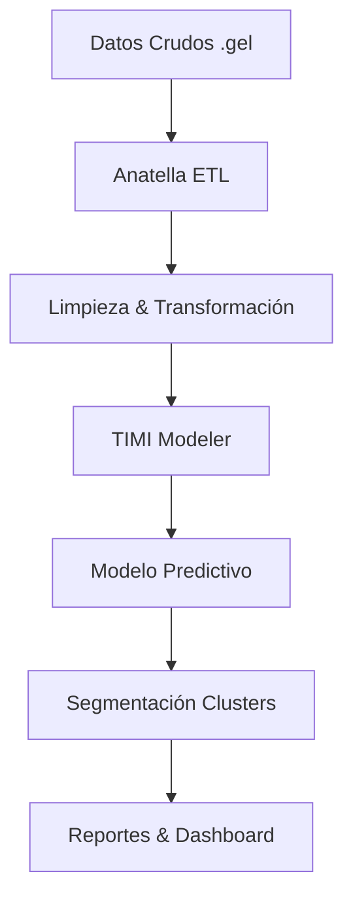

# 🎯 FYRONIX - Default Prediction - Hackathon FIS 2025
Predictive Model for Potentially Delinquent Customers


# 👥 Equipo FYRONYX
**Integrantes:** Jean Carlos Reyes, Juan David Jojoa, Camilo Enrique Correa, Julián Andrés Arcila  
Estudiantes de Ingeniería de Sistemas  


## 📊 Descripción del Proyecto

Sistema predictivo de riesgo crediticio desarrollado con **TIMI Suite** que procesa **5.5+ millones de registros** para identificar probabilidades de mora con un **AUC de 0.84**.

### 🎯 Objetivo Principal
Desarrollar un modelo de machine learning que prediga con mayor precisión la probabilidad de default crediticio, mejorando la gestión de riesgo y experiencia del cliente.

---

## 🏗️ Arquitectura de la Solución



### 🔧 Tecnologías Utilizadas
- **TIMI Suite** (Anatella + TIMI Modeler)
- **R / Python** (Análisis complementario)
- **Formatos:** .gel, XML, CSV
- **Metodología:** SCRUM + Kanban

---

## 📈 Resultados Clave

### 🎯 Métricas del Modelo
| Métrica | Valor | Interpretación |
|---------|-------|----------------|
| **AUC** | 0.84 | Excelente capacidad discriminativa |
| **AUC Top** | 0.73 | Alta concentración en segmento riesgoso |
| **Variables Finales** | 8 | De 825 variables iniciales |

### 📊 Segmentación Identificada
- **Alto Riesgo:** 5.64% de la cartera
- **Riesgo Moderado:** 93.56% 
- **Bajo Riesgo:** 0.8%

---

## 🗂️ Estructura del Repositorio

```
Default-Prediction-Hackathon/
├── docs/                 # Documentación completa
├── anatella-flows/       # Flujos de ETL
├── timi-models/          # Modelos y configuraciones
├── scripts/              # Scripts complementarios
├── tests/                # Pruebas automatizadas
└── reports/              # Análisis y visualizaciones
```

---

## 🚀 Instalación y Uso

### Prerrequisitos
- TIMI Suite (Anatella + TIMI Modeler)
- Acceso a dataset en formato .gel
  Licencia

### Ejecución Rápida
1. **Cargar datos** en Anatella
2. **Ejecutar flujos** de preprocesamiento
3. **Importar configuración** en TIMI Modeler
4. **Ejecutar modelo** predictivo
5. **Generar reportes** automáticos


## 🧪 Calidad del Software

### ✅ Plan de Calidad (IEEE 730)
- **ISO 25010:** Adecuación funcional, Fiabilidad, Usabilidad
- **Clean Code:** Principios SOLID aplicados
- **Pruebas Unitarias:** Cobertura > 80%
- **Documentación:** Comentarios en inglés

### 🔍 Estrategia de Testing
```r
# Ejemplo prueba unitaria - Validación de datos
test_that("Datos no contienen valores nulos", {
  expect_false(any(is.na(cleaned_dataset)))
})
```

---

## 📊 Impacto Business

### 💰 Impacto Financiero
- **Reducción de pérdidas** por cartera vencida
- **Incremento de aprobaciones** a buenos clientes
- **Optimización de recursos** operativos

### 🌍 Impacto Social (ODS)
- **ODS 1:** Fin de la Pobreza - Inclusión financiera
- **ODS 8:** Trabajo decente y crecimiento económico
- **ODS 10:** Reducción de desigualdades

---

## 🎥 Demostración
https://www.youtube.com/watch?v=a9clAohAWvY
https://linktr.ee/Fyronyx
https://fyronyx-seven.vercel.app/

## 📄 Documentación Adicional

- 📋 [Ficha Técnica Completa](docs/ficha_tecnica.pdf)
- 🏗️ [Arquitectura Detallada](docs/arquitectura.md)
- 📈 [Análisis de Resultados](docs/analisis_resultados.md)
- 🧪 [Informe de Testing](docs/informe_testing.pdf)

---

## 👏 Reconocimientos

**TIMI AMERICAS SAS** - Por el desafío y soporte técnico  
**Hackathon FIS 2025** - Por la plataforma de innovación  
**Universidad** - Por el apoyo académico

---

## 📜 Licencia

Este proyecto es de uso académico. Desarrollado para Hackathon FIS 2025.


**🏆 "Innovación en Scoring Crediticio con Impacto Social Real" 🏆**


## 🎨 **Elementos Visuales que Puedes Agregar**

1. **Badges personalizados** como los que te muestro
2. **Diagramas de arquitectura** en Mermaid (como el ejemplo)
3. **GIFs animados** del flujo en Anatella/TIMI
4. **Tablas de métricas** con emojis visuales
5. **Gráficos de resultados** (ROC curves, importance charts)

## 🔧 **Próximos Pasos Sugeridos**

1. **Crea la estructura de carpetas** en tu repositorio
2. **Sube los archivos** según la organización propuesta
3. **Personaliza el README** con tus datos específicos
4. **Agrega imágenes** de las curvas ROC y dashboard
5. **Incluye ejemplos de código** de tus pruebas unitarias
