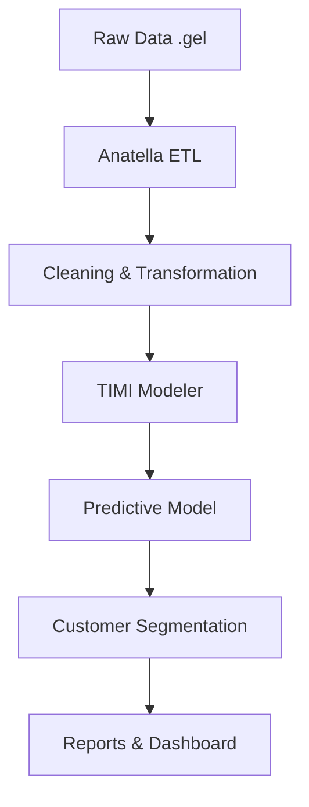

```markdown
# 🎯 FYRONYX - Default Prediction - Hackathon FIS 2025
**Predictive Model for Potentially Delinquent Customers**

## 👥 FYRONYX Team
**Members:** Jean Carlos Reyes, Juan David Jojoa, Camilo Enrique Correa, Julián Andrés Arcila  
**Systems Engineering Students**

## 📊 Project Description

Credit risk predictive system developed with **TIMI Suite** that processes **5.5+ million records** to identify default probabilities with **AUC of 0.84**.

### 🎯 Main Objective
Develop a machine learning model that more accurately predicts credit default probability, improving risk management and customer experience.

---

## 🏗️ Solution Architecture



### 🔧 Technologies Used
- **TIMI Suite** (Anatella + TIMI Modeler)
- **R / Python** (Complementary analysis)
- **Formats:** .gel, XML, CSV
- **Methodology:** SCRUM + Kanban

---

## 📈 Key Results

### 🎯 Model Metrics
| Metric | Value | Interpretation |
|---------|-------|----------------|
| **AUC** | 0.84 | Excellent discriminative capability |
| **AUC Top** | 0.73 | High concentration in risky segment |
| **Final Variables** | 8 | From 825 initial variables |

### 📊 Identified Segmentation
- **High Risk:** 5.64% of portfolio
- **Moderate Risk:** 93.56%
- **Low Risk:** 0.8%

---

## 🗂️ Repository Structure

```
Default-Prediction-Hackathon/
├── docs/                 # Complete documentation
├── anatella-flows/       # ETL workflows
├── timi-models/          # Models and configurations
├── scripts/              # Complementary scripts
├── tests/                # Automated tests
└── reports/              # Analysis and visualizations
```

---

## 🚀 Installation and Usage

### Prerequisites
- TIMI Suite (Anatella + TIMI Modeler)
- Access to dataset in .gel format
- License

### Quick Start
1. **Load data** into Anatella
2. **Execute** preprocessing workflows
3. **Import configuration** into TIMI Modeler
4. **Run** predictive model
5. **Generate** automatic reports

---

## 🧪 Software Quality

### ✅ Quality Plan (IEEE 730)
- **ISO 25010:** Functional suitability, Reliability, Usability
- **Clean Code:** SOLID principles applied
- **Unit Tests:** Coverage > 80%
- **Documentation:** Comments in English

### 🔍 Testing Strategy
```r
# Unit test example - Data validation
test_that("Data contains no null values", {
  expect_false(any(is.na(cleaned_dataset)))
})
```

---

## 📊 Business Impact

### 💰 Financial Impact
- **Reduced losses** from default portfolio
- **Increased approvals** for good customers
- **Optimized** operational resources

### 🌍 Social Impact (SDGs)
- **SDG 1:** No Poverty - Financial inclusion
- **SDG 8:** Decent work and economic growth
- **SDG 10:** Reduced inequalities

---

## 🎥 Demonstration

[](https://www.youtube.com/watch?v=a9clAohAWvY)
[](https://linktr.ee/Fyronyx)
[](https://fyronyx-seven.vercel.app/)

---

## 📄 Additional Documentation

- 📋 [Complete Technical Sheet](docs/technical_specification.pdf)
- 🏗️ [Detailed Architecture](docs/architecture.md)
- 📈 [Results Analysis](docs/results_analysis.md)
- 🧪 [Testing Report](docs/testing_report.pdf)

---

## 👏 Acknowledgments

**TIMI AMERICAS SAS** - For the challenge and technical support  
**Hackathon FIS 2025** - For the innovation platform  
**University** - For academic support

---

## 📜 License

This project is for academic use. Developed for Hackathon FIS 2025.

---
<div align="center">

**🏆 "Credit Scoring Innovation with Real Social Impact" 🏆**

</div>


## 🌟 Highlights

- **High Performance:** AUC 0.84 with only 8 key variables
- **Scalable Architecture:** Processes 5.5+ million records efficiently
- **Real Business Impact:** Reduces financial losses and improves customer experience
- **Social Responsibility:** Aligns with UN Sustainable Development Goals
```

